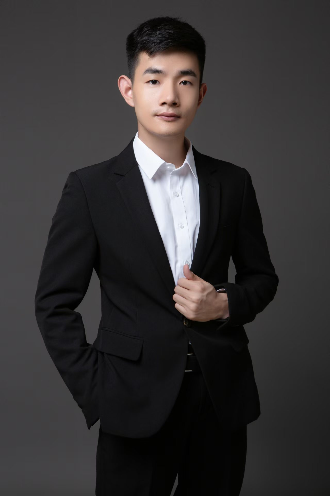

<table border="0">
  <tr>
    <td width="75%">
      <h1>蒋凯涛</h1>
      
<b>2021-2023就职于百度</b>

      
<b>2021年硕士毕业于西安交通大学人工智能学院</b>

      
<b>邮箱：1143958845@qq.com</b>

      
<b>研究方向：计算机视觉、深度学习、OCR、多模态</b>

    </td>
    <td width="25%">
      
    </td>
  </tr>
</table>

## 最新文章

    

<a href="blogs/llm/transformers/attention.md">一文看懂Attention机制 
<a href="blogs/llm/transformers/transformer.md">初识Transformer 
<a href="blogs/llm/peft/peft.md">参数高效微调技术PEFT 
<a href="blogs/llm/StableDiffusion/stable_diffusion.md">浅谈StableDiffusion 
<a href="blogs/llm/accelerate/accelerate.md">大模型训练工具之Accelerate 
<a href="blogs/llm/deepspeed/deepspeed.md">大模型训练工具之Deepspeed 
<a href="https://mp.csdn.net/console/column/allColumnList">CSDN 

